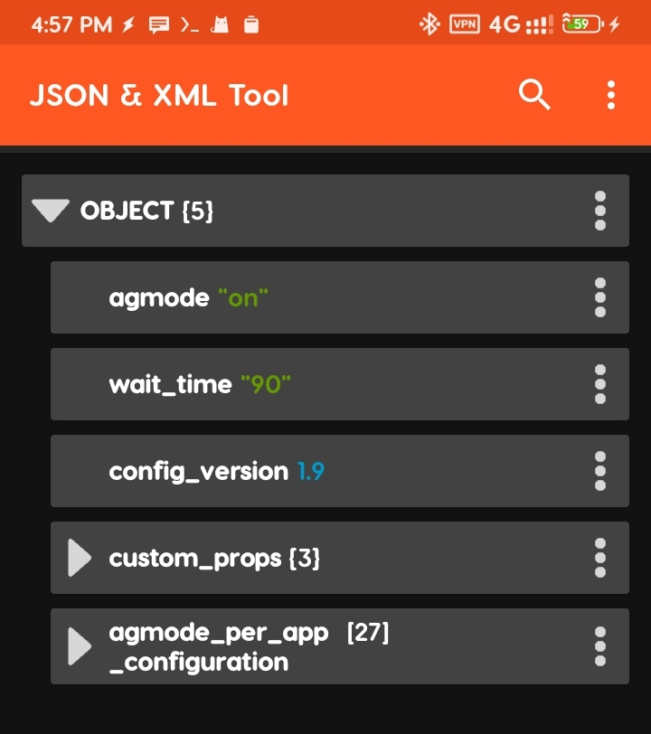
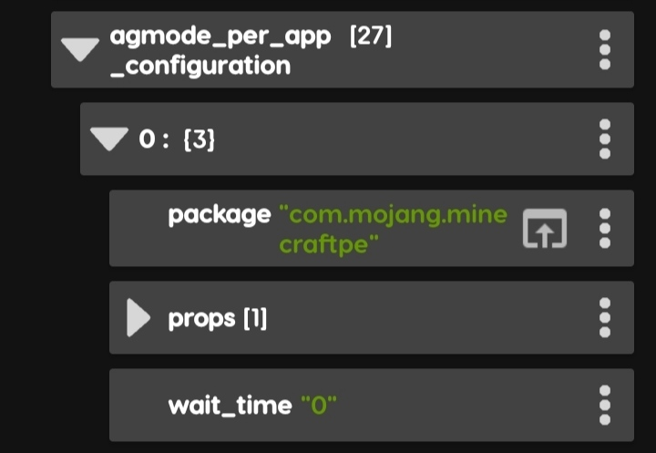

# Hi this is my first module

   

---
- [WHAT THIS MODULE DO?](#what-this-module-do)
- [WHAT IS LMKD](#what-is-lmkd)
- [FEATURES](#features)
- [CONFIGURATION](#configuration)
  - [CUSTOM PROPS](#custom-props)
  - [VIDEO EXAMPLE](#video-example)
  - [WAIT_TIME](#wait_time)
  - [PER APP WAIT_TIME](#per-app-wait_time)
- [TESTED DEVICES/DEBUG](#debug)
---

## What this module do?
Enhance multitasking performance, transition to a more advanced memory management system known as LMKD, which stands for low memory killer daemon which use PSI (Pressure stall information) which basically better for performance stability. Add SWAP and adjusts the ZRAM to occupy half of the total RAM capacity. These modifications aim to optimize memory utilization and improve the efficiency of concurrent task execution.
- This module should not interfere with any tweaks modules because it doesn't touch any kernel things, instead it just modify lmkd parameters through props manipulation.

## What is lmkd

The Android low memory killer daemon (lmkd) process monitors the memory state of a running Android system and reacts to high memory pressure by killing the least essential processes to keep the system performing at acceptable levels. These module use latest technique called "PSI monitors" because the vmpressure signals (generated by the kernel for memory pressure detection and used by lmkd) often include numerous false positives, lmkd must perform filtering to determine if the memory is under real pressure. This results in unnecessary lmkd wakeups and the use of additional computational resources. Using PSI monitors results in more accurate memory pressure detection and minimizes filtering overhead.
Details in here https://source.android.com/docs/core/perf/lmkd

## Features

- 😾 Aggressive Mode
Agressive mode make lmkd more aggressive when open specified app in `meZram-config.json` but also could do the opposite. See [configuration explanation](#explanation)
<pre>Usage: agmode [-OPTION] or OPTIONS...</pre>

MANUAL FOR AGGRESSIVE MODE MEZRAM module

- ⚠️==WARNING==⚠️
  While it is technically possible to set the "downgrade_pressure" value as high as 100, it's important to understand that going beyond the territory of 80 can be risky and may lead to performance instability.

You can use the following commands/options for managing this feature:

<pre>
-g | --get  Print LMKD properties
--enable    Enabling aggressive mode
--disable   Disabling aggressive mode
--log [line number] Show log.
--show      Showing config
--reload    Reload custom props then reapply
--help | -h [language] Show this help.
--help id Untuk menampilkan bantuan dalam bahasa Indonesia.
--rmswap    Remove SWAP from this module. Reinstall module to make new SWAP.
--switch    Switch LMKD mode. There's two mode, psi and the other one is minfree_levels which is older and less advanced mode.
--wait-time [number]   Wait time before exiting agmode after application closed. The reason is to prevent lag and apps being killed. Fill the number with 1m for 1 minute, it could also be 30 for 30 seconds.

downgrade_pressure=[value] Change ro.lmk.downgrade_pressure prop value. Value is between 0-100.
"⚠️!!! Beware not to set more than 80 in minfree_levels mode. It will break you device !!!"
</pre>

- PSI (Pressure Stall Information). Android 10 and later support a new lmkd mode that uses kernel pressure stall information (PSI) monitors for memory pressure detection. The PSI patchset in the upstream kernel (backported to 4.9 and 4.14 kernels) measures the amount of time that tasks are delayed as a result of memory shortages. As these delays directly affect user experience, they represent a convenient metric for determining memory pressure severity. The upstream kernel also includes PSI monitors that allow privileged userspace processes (such as lmkd) to specify thresholds for these delays and to subscribe to events from the kernel when a threshold is breached.
- Reduce lag while maintain multitasking performance
- Improve FPS through Agressive mode. First add game to config first in `meZram-config.json` see [configuration explanation](#explanation)
- Custom lmkd prop. Add custom prop in `meZram-config.json` file in root of internal and then enter `agmode --reload` as root user from terminal like termux. See ](https://source.android.com/docs/core/perf/lmkd) for list of customizable props.
- Change ZRAM size to 50% of RAM.
- Change SWAP size up to RAM size. Choose when installation. The default 50% allocation is typically sufficient.
- `wmemswap` command for monitoring

## CONFIGURATION
Config located in internal as `meZram-config.json`. Use app like ](https://play.google.com/store/apps/details?id=com.vibo.jsontool). Below are the config example.

or in json format below
<pre>
{
  "agmode": "on",
  "wait_time": "90",
  "config_version": 1.9,
  "custom_props": {
    "ro.lmk.use_psi": true,
    "ro.lmk.use_minfree_levels": false,
    "ro.lmk.downgrade_pressure": 40
  },
  "agmode_per_app_configuration": [
    {
      "package": "com.mobile.legends",
      "props": [
        {
          "ro.lmk.use_psi": true,
          "ro.lmk.use_minfree_levels": false,
          "ro.lmk.downgrade_pressure": 100,
          "ro.lmk.psi_partial_stall_ms": 1,
          "ro.lmk.psi_complete_stall_ms": 1,
          "ro.lmk.thrashing_limit_decay": 50,
          "ro.lmk.low": 400
        }
      ],
      "wait_time": "0"
    ]
}

</pre>

### Explanation

This config makes lmkd really aggressive, resulting in background apps stay dead and prevent them from waking up resulting in FPS improvement.
Below is configuration for game mobile legends.

<pre>
    {
      "package": "com.mobile.legends",
      "props": [
        {
          "ro.lmk.use_psi": true,
          "ro.lmk.use_minfree_levels": false,
          "ro.lmk.downgrade_pressure": 100,
          "ro.lmk.psi_partial_stall_ms": 1,
          "ro.lmk.psi_complete_stall_ms": 1,
          "ro.lmk.thrashing_limit_decay": 50,
          "ro.lmk.low": 400
        }
      ],
      "wait_time": "0"
    }
</pre>
Mobile legends is already in the config by default. If you want to add your game to the config, just duplicate the mobile legends config object and edit the duplicated object package value to your game package name.
Note that system apps may still able to waking up since lmkd rely on oom_score and system app is excluded from doze so they have high priority and low oom_score.

### VIDEO EXAMPLE
https://github.com/lululoid/meZram/assets/42432169/a5c527a8-8987-485d-a73e-45822dca98c5

To do the opposite in other word make  aggressive mode not aggressive and make lmkd hold more apps or as I called it `disaggressive mode` you can add config like below. Keep in mind that set the config like this might make your device lag or even freeze. Avoid too low `ro.lmk.downgrade_pressure`.

<pre>
    {
      "package": "com.realvnc.viewer.android",
      "props": [
        {
          "ro.lmk.use_minfree_levels": true,
          "ro.lmk.use_psi": false,
          "ro.lmk.downgrade_pressure": 30,
          "ro.lmk.thrashing_limit_decay": 50
        }
      ],
      "wait_time": "5m"
    }
</pre>

### CUSTOM PROPS

This prop applied at boot, to apply manually enter `agmode --reload` in terminal. Below I add `"ro.lmk.downgrade_pressure": 40` to make my phone less aggressive, so it able to hold more apps.

<pre>
  "custom_props": {
    "ro.lmk.use_psi": true,
    "ro.lmk.use_minfree_levels": false,
    "ro.lmk.downgrade_pressure": 40
  },
</pre>

### WAIT_TIME
Wait time is the amount of time to wait after aggressive mode or disaggressive mode is activated. The problem is that when applied props not enough to hold desired app when do multitasking, the app is automatically closed by system. This is to prevent that.

### PER APP WAIT_TIME
While wait-time is useful in disaggrssive scenario, aggressive mode not gain benefit from it. The problem that when aggressive mode is activated when wait_time is set. When game or app in aggressive mode closed, the system is still in aggressive mode, so when reopen the game or app, the app or game is alraedy killed by system because of aggressive mode. By set per app wait_time, once the game or app is closed, aggressive mode immediately deactivated so it won't kill the desired app or game , assumming the system is capable to hold the game or app.

## TODO

## DEBUG

Tested on:
- Redmi 10C:
  - MIUI 13 A12
  - MIUI 14 A12 & A13
- Realme 5 Android 10

## APPLICATION USED:
### - 
yq is a portable command-line YAML, JSON, XML, CSV, TOML and properties processor 
